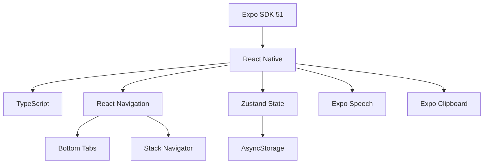

# 🚀 Colombian Spanish SRS - Project Hub

**Project Status:** 🟢 Active Development  
**Last Updated:** `2026-02-04`  
**Version:** 1.0.0 (Pre-Release)

---

## 📊 Quick Stats

```dataview
table Cards, Decks, Status
where file.name = "Project Hub"
```

| Metric            | Value          |
| ----------------- | -------------- |
| 🎴 Total Cards    | 1,016          |
| 📚 Decks          | 35             |
| 📱 Screens        | 8              |
| ✅ Features       | 15+            |
| 🔧 CI Status      | 🟡 In Progress |
| 🏷️ Current Sprint | App Store Prep |

---

## 🎯 Current Sprint: App Store Launch

### Sprint Goals

- [ ] Create app icons (1024x1024)
- [ ] Generate screenshots (5 per device)
- [ ] Write App Store description
- [ ] Submit for review
- [ ] Prepare marketing materials

### Sprint Progress

```progressbar
value: 65
max: 100
text: "App Store Readiness"
```

---

## ✅ Completed Features

### Core Learning

- [x] Spaced Repetition System (SM-2)
- [x] 1,016 flashcards across 35 decks
- [x] Text-to-speech (Colombian accent)
- [x] Audio controls (auto-speak, replay, speed)
- [x] Daily goals & progress tracking
- [x] SRS scheduling algorithm

### Organization

- [x] Browse/search all cards
- [x] Favorites/Phrasebook
- [x] Deck management (rename, delete, reset)
- [x] Category filtering
- [x] "Due Today" smart lists

### Data & Backup

- [x] Export backup (JSON to clipboard)
- [x] Import backup (from clipboard)
- [x] Offline-first architecture
- [x] Local storage (AsyncStorage)

### Quality & CI/CD

- [x] ESLint + Prettier
- [x] TypeScript
- [x] GitHub Actions CI
- [x] Automated PR testing
- [x] Card data validation

---

## 📝 Content Inventory

### Deck Categories

#### 🇨🇴 Colombian Specialties

| Deck                    | Cards | Status      |
| ----------------------- | ----- | ----------- |
| Jerga Colombiana        | 60+   | ✅ Complete |
| Paisa Slang (Medellín)  | 56    | ✅ Complete |
| Rolo Slang (Bogotá)     | 50    | ✅ Complete |
| Comida Típica           | 46    | ✅ Complete |
| Expresiones Colombianas | 61    | ✅ Complete |

#### 🗣️ Practical Conversation

| Deck                   | Cards | Status      |
| ---------------------- | ----- | ----------- |
| Frases de Conversación | 71    | ✅ Complete |
| Ligando & Relaciones   | 50    | ✅ Complete |
| Viajes & Emergencias   | 51    | ✅ Complete |
| Negocios & Trabajo     | 50    | ✅ Complete |

#### 📚 Core Vocabulary

| Deck       | Cards | Status      |
| ---------- | ----- | ----------- |
| Daily Life | ~50   | ✅ Complete |
| Family     | ~40   | ✅ Complete |
| Food       | ~40   | ✅ Complete |
| Travel     | ~40   | ✅ Complete |
| Shopping   | ~35   | ✅ Complete |
| Health     | ~40   | ✅ Complete |
| School     | ~35   | ✅ Complete |
| Work       | ~40   | ✅ Complete |

---

## 🔧 Technical Architecture

### Tech Stack



### File Structure

```
src/
├── components/       # Reusable UI
├── context/         # DeckProvider
├── data/decks/      # 35 deck files
├── hooks/           # useDeck
├── navigation/      # Tab/Stack setup
├── screens/         # 8 screens
├── storage/         # Local storage
├── styles/          # Theme
├── types/           # TypeScript
└── utils/           # SRS algorithm
```

---

## 🐛 Known Issues

### 🔴 Critical

- [ ] **CI Build Test Failing** - Missing real app icons
  - **Workaround:** Build test disabled temporarily
  - **Fix:** Add assets/icon.png, assets/splash.png

### 🟡 Medium

- [ ] Placeholder assets in repo (empty files)
- [ ] TTS voice could be more natural

### 🟢 Low

- [ ] Some decks could use more cards
- [ ] No analytics/tracking

---

## 💡 Feature Backlog

### v1.1 - Content Expansion

- [ ] Native speaker audio recordings
- [ ] 500+ more cards
- [ ] Verb conjugation deck
- [ ] Idioms & proverbs deck

### v1.2 - Gamification

- [ ] Study streak counter 🔥
- [ ] XP points system
- [ ] Achievement badges
- [ ] Daily challenges

### v1.3 - Social

- [ ] Share progress cards
- [ ] Study reminders
- [ ] Weekly progress reports

### v2.0 - Advanced

- [ ] Conversation practice mode
- [ ] Speaking exercises
- [ ] Grammar tips
- [ ] Regional accent variants

---

## 💰 Monetization Plan

### Premium Tier: $4.99 (One-time)

| Feature     | Free    | Premium        |
| ----------- | ------- | -------------- |
| Cards       | 200     | 1,016+         |
| Decks       | 7       | 35+            |
| Audio       | TTS     | Native speaker |
| Favorites   | 50      | Unlimited      |
| Cloud sync  | ❌      | ✅             |
| New content | Monthly | Weekly         |

### Revenue Projections

- **Month 1:** $0-100 (launch)
- **Month 3:** $200-500 (word of mouth)
- **Month 6:** $500-1,000 (steady)
- **Year 1:** $5,000-10,000

---

## 🎯 Marketing Plan

### Pre-Launch

- [ ] Create landing page
- [ ] Design app screenshots
- [ ] Write App Store copy
- [ ] Prepare social media assets

### Launch

- [ ] Submit to App Store
- [ ] Post on Reddit (r/Colombia, r/Spanish)
- [ ] Share on Twitter/X
- [ ] Email Colombian expat groups

### Post-Launch

- [ ] Gather user feedback
- [ ] Iterate on features
- [ ] Content marketing (blog posts)
- [ ] Influencer outreach

---

## 🔗 Related Projects

### SpiceSync (On Hold)

- **Status:** 🟡 Paused
- **Priority:** Low
- **Resume After:** Colombian Spanish v1.0 launched
- **Notes:** Privacy-first couples matching app

---

## 📝 Meeting Notes

### 2026-02-04 - PR Merge Session

- ✅ Merged all 8 pending PRs
- ✅ CI/CD pipeline operational
- ✅ All code quality checks passing
- 🟡 Build test needs real assets
- **Next:** Create app icons, prepare for App Store

### 2026-02-03 - Content Blitz

- ✅ Added 234 new cards (4 new decks)
- ✅ Total: 827 → 1,016 cards
- ✅ Fixed BusinessDeck import issue

---

## 📚 Resources

### Useful Links

- [[GitHub Repo|https://github.com/mikepitts25/Colombian-Spanish]]
- [[CI/CD Dashboard|https://github.com/mikepitts25/Colombian-Spanish/actions]]
- [[App Store Checklist|APP_STORE_CHECKLIST]]
- [[Privacy Policy|PRIVACY_POLICY]]

### Competitor Research

- **Duolingo:** Gamification master
- **Babbel:** Structured courses
- **Memrise:** Native videos
- **Anki:** SRS power user tool

### Colombian Spanish Resources

- Medellín slang guide
- Bogotá expressions
- Paisa dictionary
- Colombian food glossary

---

## 🏷️ Tags

#app #colombian-spanish #language-learning #expo #react-native #typescript #srs #flashcards #app-store #mvp #v1.0

---

_This document is maintained by Gatsby. Last updated: 2026-02-04_
